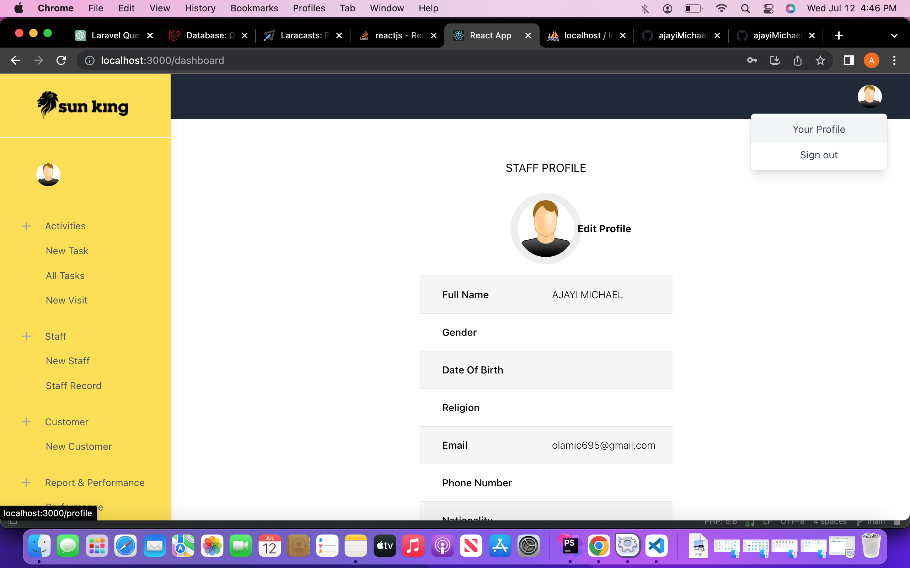

<table>
  <tr>
    <th>Endpoint</th>
    <th>Method</th>
  </tr>
  <tr>
    <td>POST /login</td>
    <td>login</td>
  </tr>
  <tr>
    <td>POST /logout</td>
    <td>logout</td>
  </tr>
  <tr>
    <td>POST /refresh</td>
    <td>refresh</td>
  </tr>
  <tr>
    <td>POST /me</td>
    <td>me</td>
  </tr>
  <tr>
    <td>GET /email-verification/{token}</td>
    <td>confirmEmail</td>
  </tr>
  <tr>
    <td>POST /staff</td>
    <td>registerStaff</td>
  </tr>
  <tr>
    <td>PUT /staff/{id}</td>
    <td>updateStaff</td>
  </tr>
  <tr>
    <td>GET /staff</td>
    <td>getAllStaff</td>
  </tr>
  <tr>
    <td>GET /staff/{id}</td>
    <td>getStaffById</td>
  </tr>
  <tr>
    <td>POST /customer</td>
    <td>registerCustomer</td>
  </tr>
  <tr>
    <td>PUT /customer/{id}</td>
    <td>updateCustomer</td>
  </tr>
  <tr>
    <td>POST /task</td>
    <td>addNewTask</td>
  </tr>
  <tr>
    <td>PUT /task</td>
    <td>updateTask</td>
  </tr>
  <tr>
    <td>POST /visit</td>
    <td>addVisitingRecord</td>
  </tr>
  <tr>
    <td>PUT /visit</td>
    <td>updateVisitingRecord</td>
  </tr>
  <tr>
    <td>GET /task/{memberId}</td>
    <td>getTaskByMemberId</td>
  </tr>
  <tr>
    <td>GET /task/approval/{taskId}/{staffId}</td>
    <td>approveTask</td>
  </tr>
  <tr>
    <td>GET /task</td>
    <td>getAllTasks</td>
  </tr>
  <tr>
    <td>GET /task-performance/{filter}</td>
    <td>getTaskPerformanceByFilter</td>
  </tr>
  <tr>
    <td>GET /report/{column}/{order}</td>
    <td>generateReport</td>
  </tr>
</table>