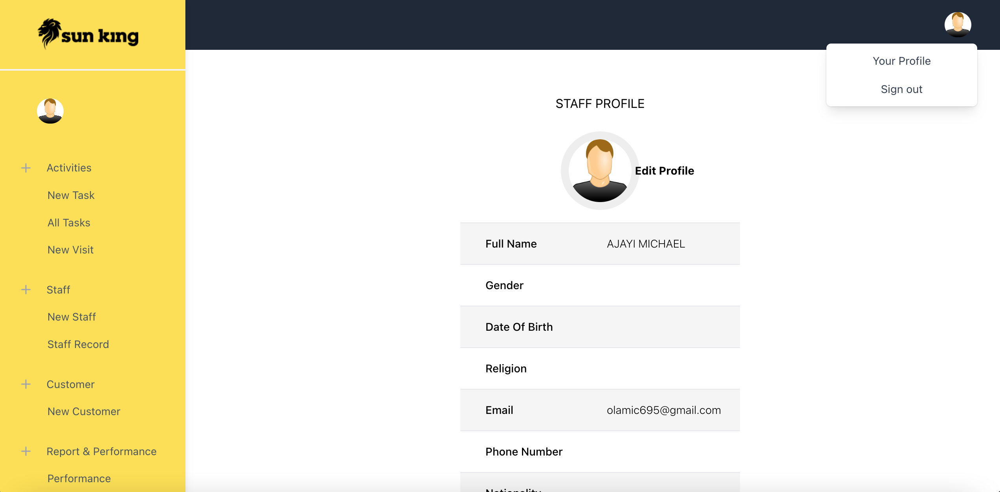

# INSTRUCTION

### The project is divided into backend and frontend
#### - Clone the Repo to your localhost
#### - Make sure your systems runs PHP 8 and above

### BACKEND SPECIFIC INSTRUCTION
#### *Please follow the instructions below to run backend:*
#### - Start your localserver e.g xampp, wamp etc then navigate to PHPMyAdmin to create a database (blog_db)
#### - create a database using the database details in .env file
#### - Navigate to backend folder using cd backend in your ide terminal .eg PHPStom
#### - Start the backend in development mode by running symfony serve -d (This assumes you have installed symfony client)
#### - Access the Api swagger ui via  http://127.0.0.1:8000/api (This assumes your port runs on 8000)
#### -Run doctrine migrate command to migrate database tables
#### - Test all the endpoints via swagger UI by following the instruction for each endpoint

### FRONTEND SPECIFIC INSTRUCTION
#### - Navigate to frontend folder using cd frontend
#### - Run npm install to install node packages
#### - Run npm start to start the React App
#### - Navigate to localhost/3000 (Assuming your React port starts on 3000)

#### To ensure Frontend connects with Backend correctly , kindly ensure the localhost address assigned to backend server is similar to the baseUrl which is located at src/assets/includes/Config.js in your frontend folder

## The following operations can be carried out based on authorization as showing below

Certainly! Here's the HTML code to display the table:

<table>
  <tr>
    <th>Endpoint</th>
    <th>Method</th>
  </tr>
  <tr>
    <td>POST /login</td>
    <td>login</td>
  </tr>
  <tr>
    <td>POST /logout</td>
    <td>logout</td>
  </tr>
  <tr>
    <td>POST /refresh</td>
    <td>refresh</td>
  </tr>
  <tr>
    <td>POST /me</td>
    <td>me</td>
  </tr>
  <tr>
    <td>GET /email-verification/{token}</td>
    <td>confirmEmail</td>
  </tr>
  <tr>
    <td>POST /staff</td>
    <td>registerStaff</td>
  </tr>
  <tr>
    <td>PUT /staff/{id}</td>
    <td>updateStaff</td>
  </tr>
  <tr>
    <td>GET /staff</td>
    <td>getAllStaff</td>
  </tr>
  <tr>
    <td>GET /staff/{id}</td>
    <td>getStaffById</td>
  </tr>
  <tr>
    <td>POST /customer</td>
    <td>registerCustomer</td>
  </tr>
  <tr>
    <td>PUT /customer/{id}</td>
    <td>updateCustomer</td>
  </tr>
  <tr>
    <td>POST /task</td>
    <td>addNewTask</td>
  </tr>
  <tr>
    <td>PUT /task</td>
    <td>updateTask</td>
  </tr>
  <tr>
    <td>POST /visit</td>
    <td>addVisitingRecord</td>
  </tr>
  <tr>
    <td>PUT /visit</td>
    <td>updateVisitingRecord</td>
  </tr>
  <tr>
    <td>GET /task/{memberId}</td>
    <td>getTaskByMemberId</td>
  </tr>
  <tr>
    <td>GET /task/approval/{taskId}/{staffId}</td>
    <td>approveTask</td>
  </tr>
  <tr>
    <td>GET /task</td>
    <td>getAllTasks</td>
  </tr>
  <tr>
    <td>GET /task-performance/{filter}</td>
    <td>getTaskPerformanceByFilter</td>
  </tr>
  <tr>
    <td>GET /report/{column}/{order}</td>
    <td>generateReport</td>
  </tr>
</table>